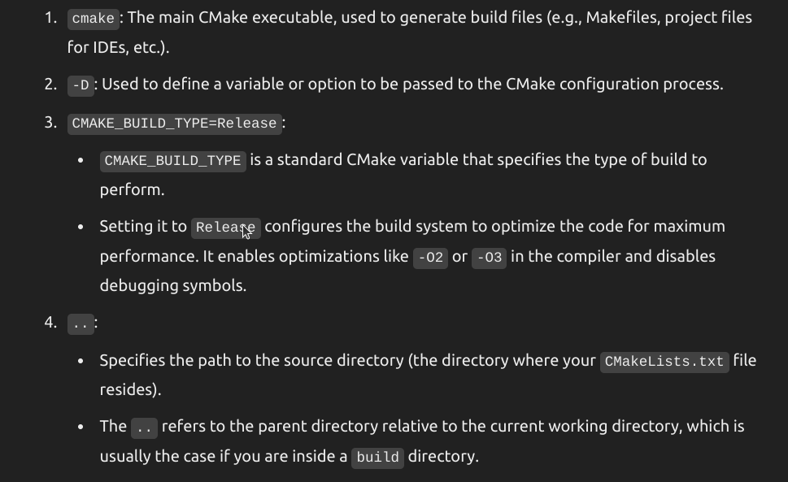
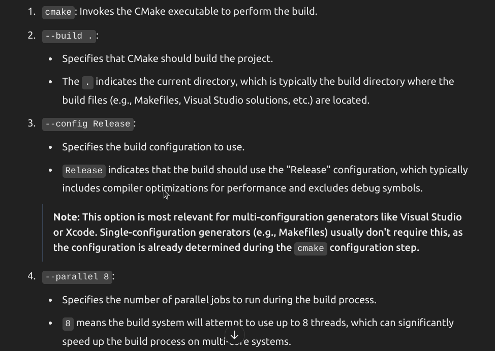
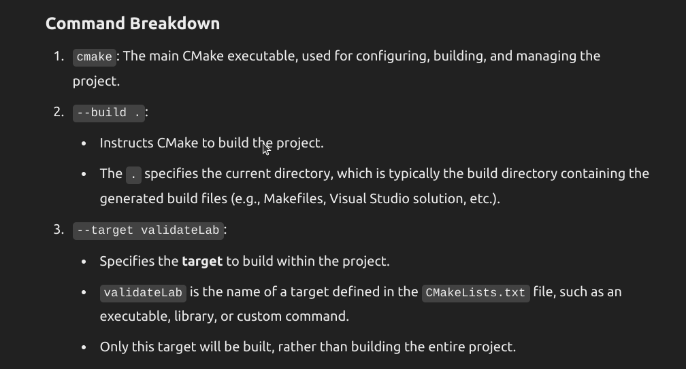
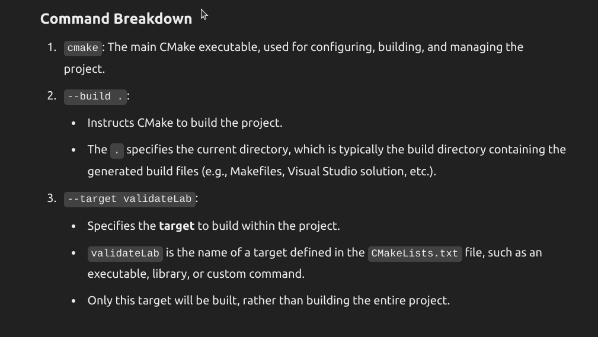

1. To run make_benchmark_library.sh
* Create  a own branch
```sh
git branch <bname>
git checkout <bname>
```
* change the mode on make_benchmark_library.sh
```sh
cd tools
chmod +x make_benchmark_library.sh
```
* Run the file
```sh
./make_benchmark_library.sh
```
* To build the warmup benchmark
```sh
cd labs/misc/warmup
cmake -E make_directory build  
cd build
```
Using cmake -E is cross-platform and avoids relying on platform-specific commands like mkdir (Linux/macOS) or md (Windows).
```sh
cmake -DCMAKE_BUILD_TYPE=Release ..
```

```sh
cmake --build . --config Release --parallel 8
```

```sh
cmake --build . --target validateLab   
```

```sh
cmake --build . --target benchmarkLab
```

* Build a benchmark with debug information (It allow us to see the source code in the performance profile)
```sh
cmake -DCMAKE_BUILD_TYPE=Debug .. -DCMAKE_C_FLAGS="-g" -DCMAKE_CXX_FLAGS="-g"

cmake --build . --config Release --parallel 8

cmake --build . --target validateLab   

cmake --build . --target benchmarkLab
```
* Performance profiling
    ```sh
    perf record ./lab
    ```
    * Error we get 
    ```
    Error:
    Access to performance monitoring and observability operations is limited.
    Consider adjusting /proc/sys/kernel/perf_event_paranoid setting to open
    access to performance monitoring and observability operations for processes
    without CAP_PERFMON, CAP_SYS_PTRACE or CAP_SYS_ADMIN Linux capability.
    More information can be found at 'Perf events and tool security' document:
    https://www.kernel.org/doc/html/latest/admin-guide/perf-security.html
    perf_event_paranoid setting is 4:
    -1: Allow use of (almost) all events by all users
        Ignore mlock limit after perf_event_mlock_kb without CAP_IPC_LOCK
    >= 0: Disallow raw and ftrace function tracepoint access
    >= 1: Disallow CPU event access
    >= 2: Disallow kernel profiling
    To make the adjusted perf_event_paranoid setting permanent preserve it
    in /etc/sysctl.conf (e.g. kernel.perf_event_paranoid = <setting>)
    ```
    * Solution for this
    ```sh
    sudo nano /etc/sysctl.conf
    kernel.perf_event_paranoid = -1 (Add ir modify this)
    (Ctrl + X to exit from nano)
    sudo sysctl -p (To save)
    ```
* Go to performance report
```sh
perf report
Go to : solution.int -> Annotate Solution
```
* To get Graphic performance : use interv2 profiler (Optional)

